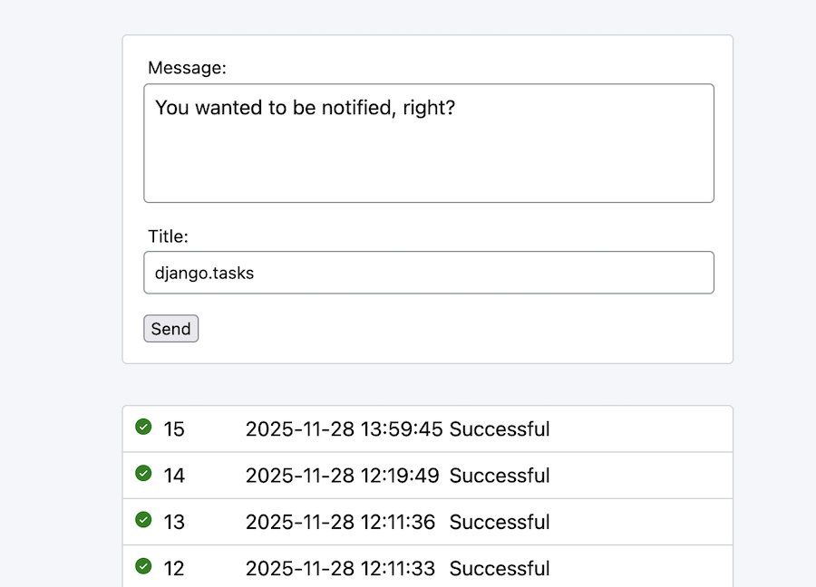

# Messagecenter

A sample project demonstrating the usage of Django 6.0 `django.tasks` module.

## How to use

First: clone this repository.

Second: this project assumes you've got a [ntfy.sh](https://ntfy.sh) account and a topic URL set as a `NTFY_URL`
environment variable. Like this:

`NTFY_URL=https://ntfy.sh/062519693d9c4913826f0a39aeea8a4c`

Ready? Finally, run the migrations and start the server like you usually would. For example if you're using uv:

```bash
uv run manage migrate
uv run manage runserver
```



## Details

For more details on this, check out the article
on [Roam*notes](https://roam.be/notes/2025/a-first-look-at-djangos-new-background-tasks/).
